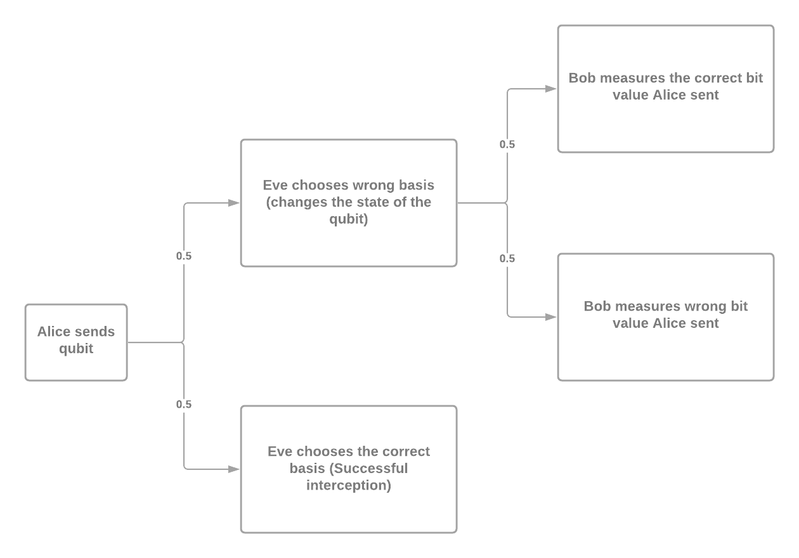

# Quantum Key Exchange (QKE)

## Qubit

For the purpose of this example I will consider qubits as photons, otherwise qubits can also be thought of as electrons spin, quantum dot etc.

Before understanding how photon relates to qubit we need to give a brief introduction to the concept of polarization.  
Photon (waves) can be polarized in three different ways: **linear**, **circular** and **elliptical**:
- **Linear polarization** is a type of light polarization where the waveform of light is limited to a single plane(Often seen as a waveform we see if we filter circular wave for a particular angle)
- **Circular Polarization** is a type of light polarization when there are two waves that are perpendicular to each other (e.g. Electromagnetic wave) while also having the same amplitude and phase shift
- **Elliptical Polarization** is a type of light polarization similar to Circular polarization, while the two waves have different amplitudes and different phase shift

The last two polarization are mentioned to avoid any confusion later on (once we introduce sub-types of polarizations).

For the case of QKE we will consider linear polarization. Its "sub-types" are **rectilinear** or **diagonal** polarization.  
Rectilinear polarization and its correspoding qubit state are chosen as: **horizontal |0>** and **vertical |1>**.

Diagonal polarization and its corresponding qubit state are chosen as: **diagonal |0>** and **anti-diagonal |1>**.

## Key Exchange (BB84 Protocol)

The purpose of the exchange is to establish a secure channel between Bob and Alice.

1.) Alice randomly selects a string of bits and a string of bases(rectilinear or diagonal) of equal length(sufficiently long). Then she transmits a photon for each bit with the corresponding polarization to Bob.  
For example, bit 1 is transmited as a vertical waveform(if Alice choses rectilinear polarization) and bit 0 as a diagonal wave(if she chooses diagonal polarization).

2.) Now Bob for each received/measured photon, randomly chooses a basis(rectilinear or diagonal). 

3.) Bob and Alice communicate through a public(unsecure) channel and match bases they have choosen. Alice informs Bob of the bases he guessed correctly. Bob and Alice then removes all bits for which Bob guessed the basis wrong.  
Note that this step should only be done AFTER Bob receives all the bits, since otherwise Eve (an attacker mentioned later) can be aware of the transmitted bases.

4.) Now, Alice and Bob have the same bit-string - the KEY.

## Security

Qubit (in our case photon) cannot be measured without being perturbated or in other words without changing it's state. To be more precise, if Eve(as a man-in-the-middle) eavesdroppes bits send from Alice to Bob - for each measured bit she has a 50/50 chance to guess the polarization correctly(consequenlty measuring the correct state of the bit). Unsuccesful choice of polarization gives here false information about the transmitted bit.  
Following her measurement she transmits her "choice" (polarization and the measure bit) to Bob (note that Eve had to re-create the state, since the one she measured from Alice is pertubated as mentioned at the beggining).  
As a countermeasure to the fact Eve can be right in half of here attempts, Bob and Alice share a few bits(about 10% usually) and check if they match. Any dissagrement of compared bits will expose the presence of an attacker. 

The following can be summarized using a table from the Wikipedia:

## Risk Analysis

In order for Alice and Bob to choose the same value of qubit, they must choose the same basis. 
In case Eve chooses the same basis, she could eavesdroppes it without causing and transmitted bit error.  
There is a:
- 50% chance Eve can guess the basis correctly
- 50% that even if Eve guesses the basis wrong, she could still measure the correct bit and transmit it to Bob

Following that there is a:

	$P(x) = (0.5*0.5)^{x}$

chance Alice and Bob might not detect Eve's eavesdropping, where x is the number of checked bits.  
For the sake of completness, here is probability graph:

And a risk evaluation scheme:

Consequently in the example script we are using 15 bits to match, since that corresponds to only 1,3% chance Eve might get away unnoticed. 

## Why it this key exchange more secure?

It's properties are based on physics rather then on math. Math can eventually be broken by using really really really strong computers, while physics not (yet).
The proof of unconditional security based on the axioms of quantum mechanics is difficult and dates back to about 2000.
